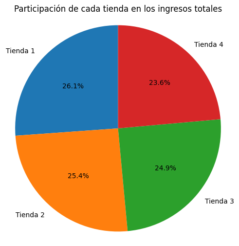
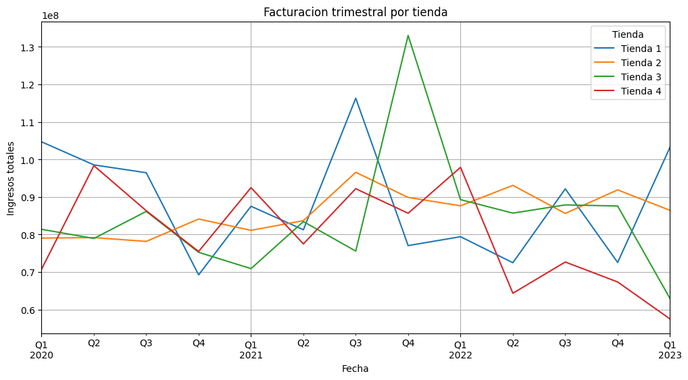
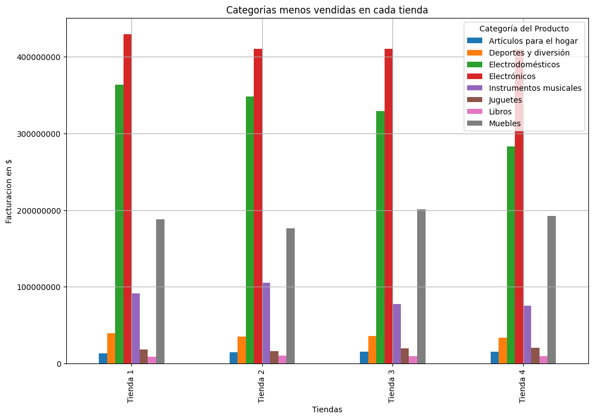
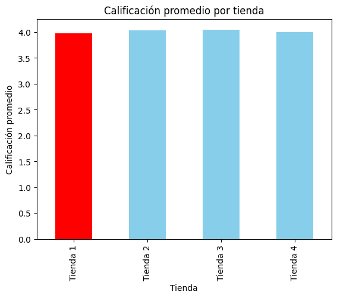
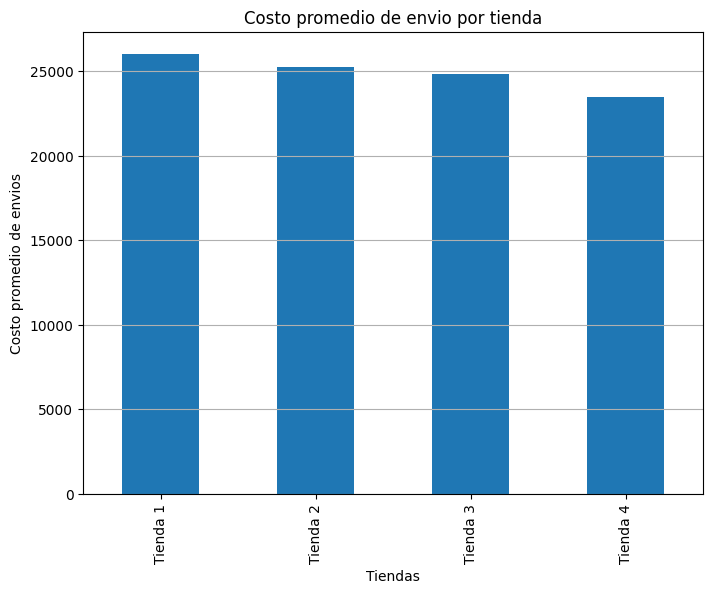

# Desafio-Alura-Store
Repositorio del Desafío 1 en analisis de datos. Fundamentos de Python y Datos G9 - ONE.
## Análisis Comparativo de Tiendas
### Descripción
Este analisis proporcionará información para evaluar el rendimiento de 4 tiendas. De forma comparativa se evalúan los ingresos totales, la facturación trimestral, su calificación promedio,  categorías más y menos vendidas, y costo de envíos. Con el objetivo de brindar información estratégica para decidir que tienda conviene vender. 

### La información proporcionada de las cuatro tiendas fue: 
'Producto', 'Categoría del Producto', 'Precio', 'Costo de envío',
 'Fecha de Compra', 'Vendedor', 'Lugar de Compra', 'Calificación',
 'Método de pago', 'Cantidad de cuotas'.

### Análisis:
Se realizaron las siguientes visualizaciones y análisis comparativos usando Pandas y Matplotlib:

* Ingresos totales:
  
  Gráfico de torta que representa los ingresos totales de las cuatro tiendas y el rendimiento de cada una.
  

  

  **La tienda de menor rendimiento es la tienda 4, la de más rendimiento es la tienda 1**

* Facturación trimestral:
  
  Gráfico de lineas que compara la facturacion trimestral de las cuatro tiendas, para profundizar la información sobre el rendimiento de las tiendas.
  

  

  **La facturación trimestral muestra un declive anual de la tienda 4.
  Se corresponde con la comparacion de las facturaciones totales de las tiendas.**

* Categorías mas y menos vendidas:
  
  Gráfico de barras que compara categorías más y menos vendidas de cada tienda para diemnsionar su impacto en la facturación de cada tienda.

  

  

  
  **Las categrías más y menos vendidas son las mismas en todas las tiendas. Esto demuestra que el rendimiento no se ve afectado por la venta mayoria de categrías de menor valor comercial,    ni por la baja de ventas de categrías de mayor valor. Disminuye proporcionalmente la facturación de todas las categorías en la tienda 4**
  
* Calificación promedio:
  
  Grafico de barras que compara la calificación de las tiendas y permite dimensionar su impacto en el rendimiento. 

  

  **Este grafico nos muestra que la calificación de las tiendas no influye en su rendimiento**

* Costos de envío:
  
  Grafico de barras que compara los costos promedio de envío por tienda para dimensionar su impacto en el rendimiento de cada tienda.
  

  

  **El costo de envío mayor es de la tienda 1 y el menor es de la tienda 4, esto demuestra que no afecta el rendimiento de las tiendas ya que es opuesto a su facturación total**

## Conclusión 
Se observa que no hay relación entre la calificación y el costo de envío con el rendimiento de las tiendas, a su vez, las categorías vendidas tienen igual proporción que en otras tiendas. Por esto no creemos que sea posible mejorar su rendimiento bajo el prisma con el que hemos realizado este analisis. Se recomienda vender la tienda 4 por ser la de menor rendimiento economico.

